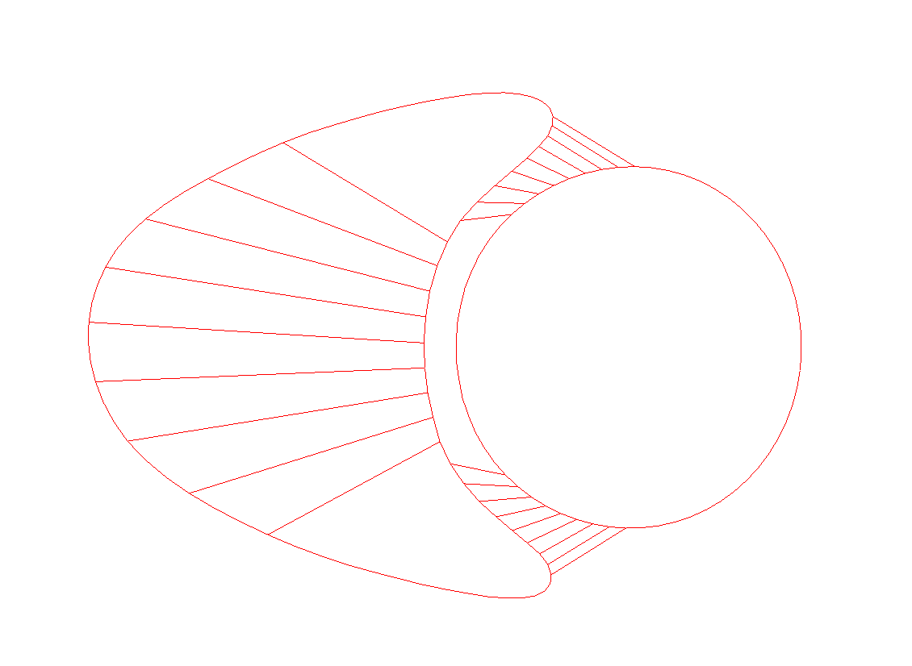

# secretory-cleft-ibamr

This project uses IBAMR and VisIt to simulate secretory clefts in CD8+ T-Cells.


## Examples



## Installation

### Installing Docker

#### Windows, Linux, MacOS (Binary Package)
https://docs.docker.com/get-docker/

#### MacOS
Recommended install with cask: `brew cask install docker`

### Pulling Docker Image from Docker Hub
```
docker pull ericlee3141/ibamr_secretory_cleft:latest
docker image ls # Note <IMAGE ID>
docker tag <IMAGE ID> <YOUR IMAGE NAME>:latest
docker rmi ericlee3141/ibamr_secretory_cleft:latest
docker run -n <YOUR CONTAINER NAME> -it <YOUR IMAGE NAME>
```

## Usage

### Generate Simulation Input data
```
cd /PATH/TO/FOLDER
git clone https://github.com/ericlovesmath/secretory-cleft-ibamr
cd secretory-cleft-ibamr
python CircleTest.py # Requires Python 3.6+
```
Edit `secretory-cleft-ibamr/CircleTest.py` following the instructions written in the code.

`secretory-cleft-ibamr/fila_256` will be generated holding `FILA_256.xxx` files for IBAMR.

### Running Simulation
```
docker start -i <YOUR CONTAINER NAME>
cd /usr/test/sfw/ibamr/ibamr-objs-opt/examples/IB/explicit/test
```
Replace all `FILA_256.xxx` from the Python script

Leave preexisting `FILA_256.xxx` files not generated from the Python script alone
```
./main2d input2d
exit
```
### Exporting Simulation Data
```
cd /PATH/TO/FOLDER
docker cp <YOUR CONTAINER NAME>:/usr/test/sfw/ibamr/ibamr-objs-opt/examples/IB/explicit/test/viz_IB2d/ .
```

## Visualizing Data

### Installing VisIt (Binary Package)
https://wci.llnl.gov/simulation/computer-codes/visit/executables

#### Navigating VisIt

> Open > `secretory-cleft-ibamr/viz_IB2d` > lag_data.visit

> Add > Subset > fila_256_mesh

> Open > dumps.visit

> dumps.visit:Subset - levels > Delete

> Add > Pseudocolor > P

> dumps.visit:Pseudocolor - P > Pseudocolor > Opacity > Constant > 20%

> Draw

<!--
# Add them as collab 
# Make movie recordings / Screenshots + labels
# More gifs
-->